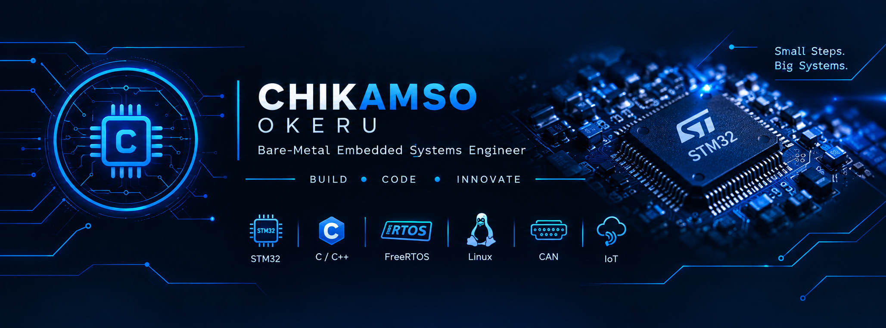

<div align="center">



# 👋 Hi, I'm Chikamso Okeru

### Bare-Metal Embedded Systems Engineer ⚙️


<br>


</div>

---

## 🚀 About Me

<table>
<tr>
<td width="65%">

Hi! I'm **Chikamso Okeru**, an aspiring **Embedded Systems Engineer** passionate about building reliable firmware and understanding hardware from the register level upward.

I'm currently focused on mastering **Bare-Metal STM32 development**, where I write peripheral drivers from scratch instead of relying on vendor HAL libraries. My goal is to build a strong foundation before moving into **Real-Time Operating Systems (FreeRTOS)** and **Embedded Linux**.

I'm especially interested in:

* ⚙️ Embedded Systems
* 🔌 Firmware Development
* 🖥️ Microcontrollers (STM32)
* 🚌 Communication Protocols (UART, SPI, I²C, CAN)
* 🐧 Embedded Linux
* ⏱️ Real-Time Operating Systems (FreeRTOS)
* 🚗 Automotive Embedded Systems
* 🌐 Internet of Things (IoT)

I'm currently transitioning from learning embedded concepts to building **production-style firmware projects** that demonstrate real engineering principles.

My long-term goal is to become a professional **Embedded Software Engineer**, contributing to innovative firmware, embedded Linux systems, and next-generation connected devices.
<br>

** 🧠 Engineering Philosophy

> "I believe the best embedded engineers understand not only how software works, but why the hardware behaves the way it does.

> Every driver I write brings me closer to mastering the interaction between silicon and software."

<br>

> ⚡ **Understand the Hardware. Build the Firmware. Never Stop Learning.**

</td>

<td width="35%" align="center">


<br><br>

**Currently Learning**

⚙️ STM32 Bare-Metal Drivers  
🚌 CAN Protocol  
📚 FreeRTOS  
🐧 Embedded Linux

</td>
</tr>
</table>

---

## 🎯 Current Focus
<div align="center">

```text
✅ Bare-Metal STM32 Development

🔄 CAN Protocol

📚 FreeRTOS

🐧 Embedded Linux

⚙️ Linux Device Drivers

🚀 Buildroot & Yocto
```
</div>


# 🛠 Tech Stack

<p align="center">


<br><br>


</p>

---

# 📂 Featured Projects

<table>

<tr>

<td width="50%" valign="top">

## ⚙️ Embedded Systems Projects

Professional bare-metal STM32 peripheral drivers.

**Highlights**

- GPIO Drivers
- USART Drivers
- SPI Drivers
- I2C Drivers
- RCC Drivers
- Interrupt-driven firmware

<p>

<a href="https://github.com/kamso422/Embedded-Systems-Projects">


</a>

</p>

</td>

<td width="50%" valign="top">

## 🚀 STM32F446 Portfolio

Real embedded firmware applications.

**Highlights**

- UART CLI
- GPIO Applications
- Frequency Measurement
- Timers
- Clock Configuration

<p>

<a href="https://github.com/kamso422/stm32f446_portfolio">


</a>

</p>

</td>

</tr>

<tr>

<td width="50%" valign="top">

## 🧠 Assembly Language

Learning low-level programming fundamentals.

**Highlights**

- CPU Instructions
- Registers
- Memory Operations
- Assembly Programming

<p>

<a href="https://github.com/kamso422/Learn-Assembly-Language-">


</a>

</p>

</td>

<td width="50%" valign="top">

## 💻 C Projects

Strengthening core programming fundamentals.

**Highlights**

- Algorithms
- Data Structures
- Memory Management
- Console Applications

<p>

<a href="https://github.com/kamso422/C-projects">


</a>

</p>

</td>

</tr>

</table>

---

# 📊 GitHub Analytics

<div align="center">





</div>

<br>

<div align="center">


</div>

---

# 🐍 Contribution Snake

<div align="center">

<picture>
  <source media="(prefers-color-scheme: dark)" srcset="https://raw.githubusercontent.com/kamso422/kamso422/output/github-contribution-grid-snake-dark.svg">
  <source media="(prefers-color-scheme: light)" srcset="https://raw.githubusercontent.com/kamso422/kamso422/output/github-contribution-grid-snake.svg">
  
</picture>

</div>

---

# 📈 My Development Journey

<div align="center">


</div>

---

# 🤝 Connect With Me

<p align="center">

<a href="https://github.com/kamso422">


</a>

<a href="mailto:kamso422@gmail.com">


</a>

<a href="https://www.linkedin.com/in/chikamsookeru">


</a>

<a href="https://www.instagram.com/solof_al/">


</a>

</p>

---

<div align="center">

## ⚡ Thanks for Visiting!

**Code. Build. Innovate.**

*Turning ideas into embedded systems, one register at a time.*

<br>


</div>
